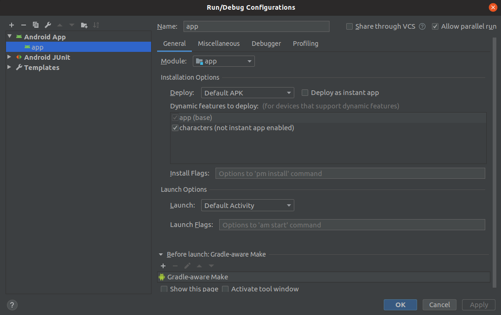

# A sample modular Android app
This sample app has been developed with Kotlin following an MVVM architecture pattern with a modular approach.

# Working

# Branches
## [master](https://github.com/karntrehan/Starwars/tree/coroutines)
* **[Koin](https://github.com/InsertKoinIO/koin)**: Dependency injection
* **[Reactive streams](https://github.com/ReactiveX/RxJava)**: Networking & Async.
* **[LiveData and ViewModel](https://developer.android.com/topic/libraries/architecture)**: Isolate business logic and maintain state.

## [coroutines](https://github.com/karntrehan/Starwars/tree/coroutines)
* **[Dagger 2](https://dagger.dev/)**:Dependency injection
* **[Coroutines](https://kotlinlang.org/docs/reference/coroutines-overview.html)**: Networking & Async.
* **[LiveData and ViewModel](https://developer.android.com/topic/libraries/architecture)**: Isolate business logic and maintain state.

# Decisions
* **Koin**: This is my first experiment with Koin, and it turned out to be straight-forward to implement. The performance is also great. Although, feature module support is something they are still working on.
* **Modular**: The app is developed with a modular approach to support instant apps & dynamic delivery for the users. Modularity also allows us to have faster gradle build speeds, clear ownerships amongst the team & cleaner git flows. More info about modular apps can be found [here](https://medium.com/mindorks/writing-a-modular-project-on-android-304f3b09cb37).

# Structure
`app` module is where the application initializes & `characters` dynamic module is where our sample screens reside. 
`CharacterActivity` holds the `CharacterSearchFragment` & `CharacterDetailsFragment`.
The packages are "by-feature" for easier access.

# Running
You will need a device / emulator with Android Oreo (API 27) and up.

# Testing
Test cases for the [`CharacterSearchVM`](characters/src/test/java/com/karntrehan/starwars/characters/search/CharacterSearchVMTest.kt) & [`CharacterDetailsVM`](characters/src/test/java/com/karntrehan/starwars/characters/details/CharacterDetailsVMTest.kt) have been implemented.

# Write-ups
* [Rx vs Coroutines: Complex network chains on Android](https://medium.com/mindorks/rx-vs-coroutines-complex-network-chains-on-android-19d20d164cd1)

# Contribution
Feel free to open an issue or submit a pull request with improvements.

# Licence
    MIT License

    Copyright (c) 2019 Karan Trehan
    
    Permission is hereby granted, free of charge, to any person obtaining a copy
    of this software and associated documentation files (the "Software"), to deal
    in the Software without restriction, including without limitation the rights
    to use, copy, modify, merge, publish, distribute, sublicense, and/or sell
    copies of the Software, and to permit persons to whom the Software is
    furnished to do so, subject to the following conditions:
    
    The above copyright notice and this permission notice shall be included in all
    copies or substantial portions of the Software.
    
    THE SOFTWARE IS PROVIDED "AS IS", WITHOUT WARRANTY OF ANY KIND, EXPRESS OR
    IMPLIED, INCLUDING BUT NOT LIMITED TO THE WARRANTIES OF MERCHANTABILITY,
    FITNESS FOR A PARTICULAR PURPOSE AND NONINFRINGEMENT. IN NO EVENT SHALL THE
    AUTHORS OR COPYRIGHT HOLDERS BE LIABLE FOR ANY CLAIM, DAMAGES OR OTHER
    LIABILITY, WHETHER IN AN ACTION OF CONTRACT, TORT OR OTHERWISE, ARISING FROM,
    OUT OF OR IN CONNECTION WITH THE SOFTWARE OR THE USE OR OTHER DEALINGS IN THE
    SOFTWARE.    